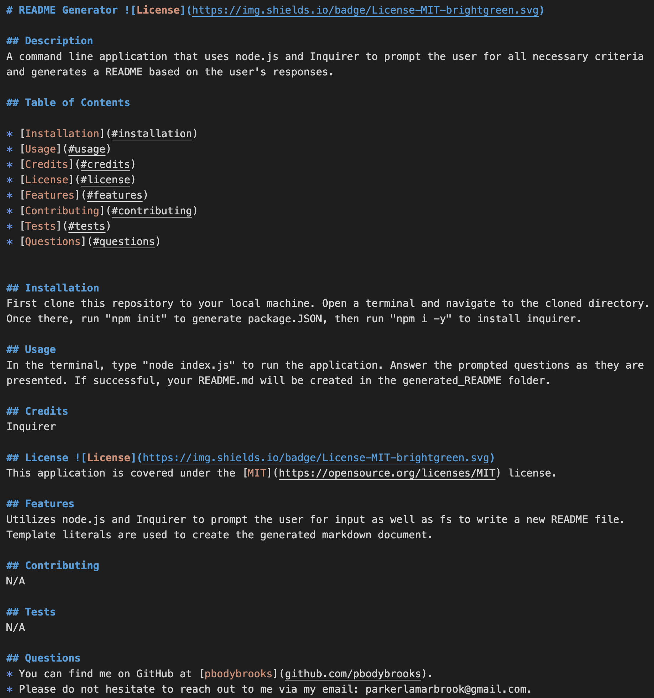

# parker-brook-README-Generator-Challenge07 
Repo for README Generator - Challenge 07

## Description 
A command line application that uses node.js and Inquirer to prompt the user for all necessary criteria and generates a README based on the user's responses.

## Table of Contents

* [Installation](#installation)
* [Usage](#usage)
* [Credits](#credits)
* [License](#license)
* [Features](#features)
* [Contributing](#contributing)
* [Tests](#tests)
* [Questions](#questions)

## Video Demonstration
[Link to video demonstration](https://drive.google.com/file/d/11A9l32Ha0ymNBk8zuMmT9PdSglLx7T04/view)

## Screenshot

## Installation 
First clone this repository to your local machine. Open a terminal and navigate to the cloned directory. Once there, run "npm i" to install inquirer.

## Usage 
In the terminal, type "node index.js" to run the application. Answer the prompted questions as they are presented. If successful, your README.md will be created in the generated_README folder.

## Credits 
Inquirer

## License 
This application is covered under the [MIT](https://opensource.org/licenses/MIT) license.

## Features 
Utilizes node.js and Inquirer to prompt the user for input as well as fs to write a new README file. Template literals are used to create the generated markdown document.

## Contributing 
N/A

## Tests 
N/A

## Questions 
* You can find me on GitHub at [pbodybrooks](https://github.com/pbodybrooks). 
* Please do not hesitate to reach out to me via my email: parkerlamarbrook@gmail.com.
